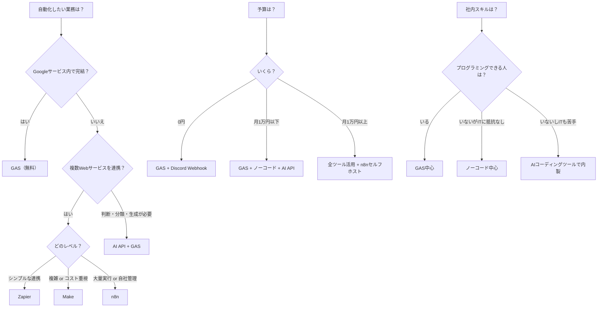

| 項目 | 内容 |
|------|------|
| 対象読者 | 業務自動化を始めたい中小企業の経営者・担当者 |
| この記事でわかること | 規模・業務タイプ別のツール選定基準 |
| 前提知識 | 不要 |
| 関連記事 | [自動化ツール比較表](/articles/reviews/automation-tools-matrix) |

中小企業の自動化ツール選びは「規模」と「業務タイプ」の2軸で決まります。
従業員50名以下でGoogle Workspace利用中ならGAS、複数サービス連携ならノーコード、判断を伴う処理ならAI APIが最適です。
この記事では、3カテゴリのツールを比較し、選定フローチャートで最適なツールを導きます。

## 自動化ツール3カテゴリの全体像

自動化ツールとは、手作業でおこなっている業務をプログラムやサービスの連携で自動実行する仕組みの総称です。中小企業向けの自動化ツールは大きく3つのカテゴリに分かれます。

| カテゴリ | 代表ツール | 費用（2026年2月時点） | 難易度 | 得意な業務 |
|---------|----------|------|--------|----------|
| GAS（Google Apps Script） | Googleが提供する無料のスクリプト実行環境 | 無料 | 低〜中 | Googleサービス内の自動化 |
| ノーコード | [Zapier](https://zapier.com/pricing) / [Make](https://www.make.com/en/pricing) / [n8n](https://n8n.io/pricing/) | 無料〜月$20 | 低 | 複数Webサービスの連携 |
| AI API | [Claude API](https://www.anthropic.com/pricing) / [OpenAI API](https://openai.com/api/pricing/) | 従量課金 | 中 | 判断・分類・生成を伴う処理 |

**用語の補足:**

- **GAS（Google Apps Script）**: Googleが提供する無料のスクリプト実行環境です。スプレッドシートやGmailなどのGoogleサービスをJavaScriptで操作できます
- **ノーコード**: プログラミング不要で、操作画面（GUI）だけでシステムを構築できるツールの総称です
- **API（Application Programming Interface）**: ソフトウェア同士をつなぐ窓口のことです。AI APIを使うと、自分のプログラムからAIの機能を呼び出せます
- **n8n**: ソースコードが公開されているワークフロー自動化ツールです。自社サーバーで運用（セルフホスト）すれば無料で利用できます

各カテゴリの詳細比較は[自動化ツール比較表](/articles/reviews/automation-tools-matrix)をご覧ください。

## 規模別のツール選定おすすめ

規模別のツール選定とは、従業員数や業務量に応じて最もコスト効率が良いツールの組み合わせを選ぶことです。自社の規模に合ったツールを選ぶことで、無駄なコストを抑えながら自動化の効果を最大化できます。

### 1〜10名（個人事業主・少人数チーム）

| 推奨ツール | 用途 | 月額費用（2026年2月時点） |
|----------|------|---------|
| GAS | スプレッドシート集計・メール送信 | 0円 |
| Discord Webhook | チーム通知 | 0円 |

**Webhook（ウェブフック）** とは、特定のイベント発生時に自動でデータを送信する仕組みです。Discord Webhookを使えば、プログラミングの知識がなくても通知を自動化できます。

GASだけで社内業務の80%を自動化できます。始め方は[GASでできること完全ガイド](/articles/gas/gas-basics)をご覧ください。

### 11〜50名（小規模企業）

| 推奨ツール | 用途 | 月額費用（2026年2月時点） |
|----------|------|---------|
| GAS | Googleサービス内の自動化 | 0円 |
| Make or n8n | 外部サービス連携 | 0〜月$9（[Make公式料金](https://www.make.com/en/pricing)） |
| Claude API（Haiku 4.5） | 問い合わせ分類・要約 | 月約100円（1日あたり約50件の分類処理を想定。[Anthropic公式料金](https://www.anthropic.com/pricing)） |

ノーコードツールを追加し、サービス間連携を強化するフェーズです。[Zapier vs Make比較](/articles/no-code/zapier-vs-make)で最適なツールを選んでください。

### 51〜100名（中規模企業）

| 推奨ツール | 用途 | 月額費用（2026年2月時点） |
|----------|------|---------|
| GAS | 基盤の自動化 | 0円 |
| n8n（セルフホスト） | 大量ワークフロー | 月約500〜1,500円（VPSサーバー費用。さくらVPS等を想定） |
| AI API | 業務プロセスへのAI組み込み | 月約500〜2,000円（[Anthropic公式料金](https://www.anthropic.com/pricing)。利用量により変動） |

**セルフホスト** とは、自社のサーバーでソフトウェアを運用することです。クラウドサービスの月額料金の代わりにサーバー費用だけで済むため、大量のワークフロー実行時にコストを抑えられます。

ワークフロー数が増えるためn8nセルフホストが費用対効果で有利です。[n8nセルフホスティングガイド](/articles/no-code/n8n-self-hosting)を参照してください。

## 業務タイプ別の自動化ツールおすすめ

業務タイプ別の自動化ツールおすすめとは、自動化したい業務の内容に応じたツールの使い分けのことです。「何を自動化したいか」から逆引きで最適なツールを選べます。

| 業務タイプ | 最適ツール | 具体例 |
|----------|----------|--------|
| データ集計・転記 | GAS | 月次売上集計、日報まとめ |
| メール送信 | GAS | 一斉送信、自動返信 |
| 通知（社内） | GAS + Discord/Slack | 定時通知、アラート |
| 複数サービス連携 | ノーコード | フォーム→シート→Slack→メール |
| テキスト分類・要約 | AI API + GAS | 問い合わせ振り分け、議事録要約 |
| 帳票生成 | GAS | PDF請求書、報告書 |

## 選定フローチャート

選定フローチャートとは、3つの質問に答えるだけで自社に最適なツールが決まる判断ガイドです。以下のフローに沿って選んでください。

## まとめ

迷ったら、まずGASで1つの業務を自動化するところから始めてください。無料でリスクなく効果を実感でき、そこからノーコードやAI APIへ段階的に拡張していくのが最も効率的なルートです。

自動化の優先順位は[何から自動化すべきか？](/articles/frameworks/where-to-automate-first)をご覧ください。全体ロードマップは[中小企業のAI業務自動化ロードマップ](/articles/frameworks/automation-roadmap)で解説しています。

### 次のステップ

ツールが決まったら、以下のLayer 2（実践編）記事で具体的な手順に進みましょう。

- GASで始めるなら → [GASでできること完全ガイド](/articles/gas/gas-basics)
- ノーコードで始めるなら → [Zapier vs Make徹底比較](/articles/no-code/zapier-vs-make)
- n8nセルフホストなら → [n8nセルフホスティングガイド](/articles/no-code/n8n-self-hosting)
